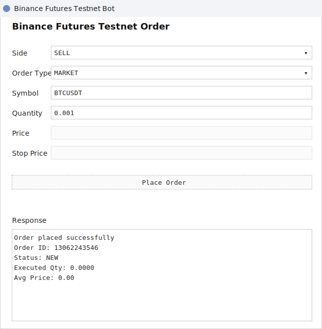

# Binance Futures Testnet Trading Bot

Small Python application for placing `MARKET`, `LIMIT`, and `STOP_LIMIT` orders on the Binance Futures Testnet (USDT-M). The project includes both a CLI and a lightweight desktop UI, with a reusable Binance client layer, an order service layer, input validation, and file-based logging.

## Features

- Places `MARKET`, `LIMIT`, and `STOP_LIMIT` orders on Binance Futures Testnet
- Supports both `BUY` and `SELL`
- Validates CLI input before sending requests
- Includes an enhanced CLI UX with examples and clear validation messages
- Logs API requests, responses, and errors to `logs/trading.log`
- Handles invalid input, missing credentials, Binance API errors, and network failures
- Prints a clear request summary and response summary in the terminal
- Includes a lightweight Tkinter UI for manual order entry

## Project Structure

```text
binance-trading-bot/
|-- bot/
|   |-- __init__.py
|   |-- client.py
|   |-- logging_config.py
|   |-- orders.py
|   `-- validators.py
|-- cli.py
|-- ui.py
|-- README.md
`-- requirements.txt
```

## Requirements

- Python 3.10+
- Binance Futures Testnet account
- Binance Futures Testnet API key and secret

Testnet base URL used by the application:

`https://testnet.binancefuture.com`

## Setup

1. Clone the repository.
2. Create and activate a virtual environment.
3. Install dependencies:

```bash
pip install -r requirements.txt
```

4. Create a `.env` file in the project root:

```env
BINANCE_API_KEY=your_testnet_api_key
BINANCE_API_SECRET=your_testnet_api_secret
```

## How to Run

### MARKET order

```bash
python cli.py --symbol BTCUSDT --side BUY --type MARKET --quantity 0.001
```

### LIMIT order

```bash
python cli.py --symbol BTCUSDT --side SELL --type LIMIT --quantity 0.001 --price 70000
```

### STOP_LIMIT order

```bash
python cli.py --symbol BTCUSDT --side BUY --type STOP_LIMIT --quantity 0.001 --price 71000 --stop-price 70500
```

### Help

```bash
python cli.py --help
```

### Lightweight UI

```bash
python ui.py
```

## UI Preview

The desktop UI provides a simple way to place `MARKET`, `LIMIT`, and `STOP_LIMIT` orders manually while reusing the same validation and logging flow as the CLI.



## Example Output

```text
=== ORDER REQUEST ===
Symbol: BTCUSDT
Side: BUY
Type: MARKET
Quantity: 0.001

=== ORDER RESPONSE ===
Order ID: 123456789
Status: FILLED
Executed Qty: 0.001
Avg Price: 68421.50

SUCCESS: Order placed successfully.
```

## Logging

- Runtime log file: `logs/trading.log`
- The log captures request payloads, API responses, and stack traces for failures
- Sample submission logs are included in `docs/logs/market-order.log` and `docs/logs/limit-order.log`
- If you showcase the bonus feature, you can also include one `STOP_LIMIT` log entry or a screenshot of the UI

## Assumptions

- The task is scoped to Binance Futures Testnet `USDT-M`
- `STOP_LIMIT` is included as the optional bonus order type
- `LIMIT` orders are sent with `timeInForce=GTC`
- `STOP_LIMIT` orders are sent to Binance Futures as `STOP` with `price`, `stopPrice`, and `timeInForce=GTC`
- The application assumes the account and symbol are enabled on the Futures Testnet

## Verification Performed

The following local checks were completed:

- CLI help command runs successfully
- UI module imports successfully
- Input validation catches malformed arguments before any API call
- Dependencies are installed in the local virtual environment
- One `MARKET` order and one `LIMIT` order were placed successfully on Binance Futures Testnet

Live order placement requires valid Binance Futures Testnet credentials in `.env`.
